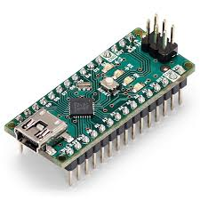

  

# 🔧 Projetos com Arduino Nano

Esta pasta contém exemplos e experimentos realizados com o **Arduino Nano**, ideal para projetos compactos e de baixo consumo.

## 📘 Conteúdo

Inclui:
- Controle de LEDs, sensores e motores  
- Leitura de sensores analógicos e digitais  
- Projetos básicos de automação  
- Comunicação serial com outras placas  

## 🧰 Ferramentas recomendadas

- **Arduino IDE** (instalação padrão)  
- Porta: **Arduino Nano (ATmega328P)**  

## ⚙️ Objetivo

Fornecer códigos de exemplo e testes para projetos que exigem tamanho reduzido e simplicidade de montagem utilizando o **Arduino Nano**.

---
---

  

📄 *Autor: Izaias Neri*  
📅 *Última atualização: novembro de 2025*
