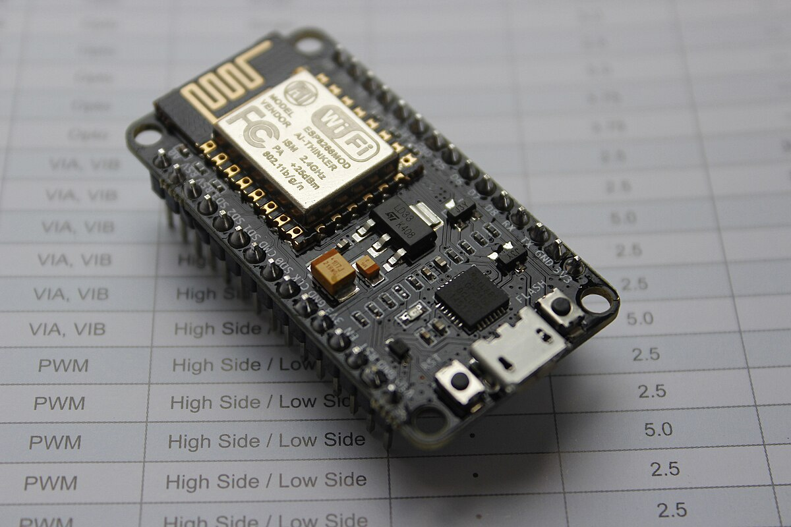

 
  

# 🧠 Projetos com ESP8266 (NodeMCU)

Esta pasta reúne códigos e exemplos práticos desenvolvidos para a placa **ESP8266**, também conhecida como **NodeMCU**.  

## 📘 Conteúdo

Aqui você encontrará:
- Exemplos de **conexão Wi-Fi** (modo *Access Point* e *Station*);  
- **Servidores web embarcados** com controle via navegador (HTML e botões);  
- Projetos de **automação e IoT**;  
- Controle de **motores, LEDs e sensores**;  
- Comunicação entre dispositivos e integração com outras placas.  

## 🧰 Ferramentas recomendadas

- **Arduino IDE** com suporte à placa ESP8266  
  (adicione o gerenciador: `http://arduino.esp8266.com/stable/package_esp8266com_index.json`)  
- **Thonny IDE** ou **uPyCraft** para códigos em **MicroPython**  

## ⚙️ Objetivo

Servir como base de estudo e desenvolvimento para projetos conectados utilizando a placa **ESP8266**, explorando suas capacidades de rede e controle.

---

  

---
📄 *Autor: Izaias Neri*  
📅 *Última atualização: novembro de 2025*
